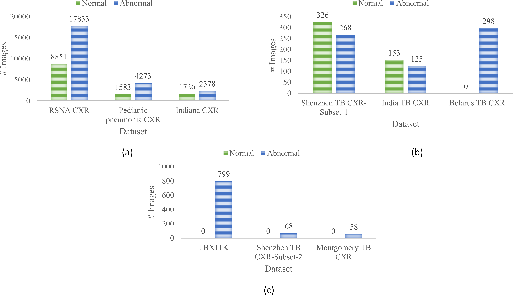

# UNets-for-TB-segmentation-and-localization

At present, machine learning, particularly deep learning (DL) has drawn tremendous attention and has demonstrated state-of-the-art performance toward natural and medical image analyses. DL models are shown to be effective, particularly for medical image analysis tasks, including segmentation, classification, and visual quality assessment. Convolutional neural network (CNN)-based segmentation models like U-Nets have delivered superior segmentation performance toward natural and medical image segmentation tasks compared to conventional threshold-, region-, and clustering-based methods. Literature studies reveal that using medical modality-specific pretrained DL models helps transfer modality-specific knowledge to a relevant target task compared to those pretrained on stock photographic images, thereby improving model adaptation, generalization, and class-specific region of interest (ROI) localization. In this study, we propose the benefits offered through training custom chest X-ray (CXR) modality-specific U-Net models toward segmenting the lungs and Tuberculosis (TB)-related manifestations using CXRs. We further evaluate segmentation performance by augmenting the training data with coarse TB localizations produced by the best-performing classification model. Such augmentation is proposed to improve performance with the test data derived from the same training distribution and with other cross-institutional test collections. To this end, we observed that the combination of CXR modality-specific pretraining and augmented training helped the U-Net models to achieve superior performance toward TB segmentation and localization. We believe that this is the first study to i) use custom, CXR modality-specific U-Nets to segment lungs and TB-specific disease manifestations using CXRs; ii) evaluate the segmentation performance while augmenting the training data with coarse disease localizations; and, (iii) evaluate segmentation performance with cross-institutional test collections to observe model robustness and generalization.

The repository includes a Jupyter notebook file that contains the code for the entire project with detailed discussions about the various levels of thhis stagewise, systematic study. The manuscript is currently under preparation. 
